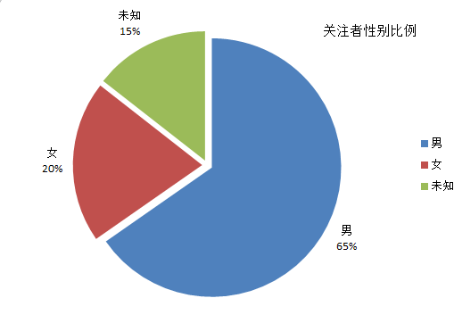

# 北航知乎热点问题调查

##起因
某变态进入我航主南女卫生间偷拍被抓，我院希望息事宁人，引起广大学生不满，知乎上
同学们群情激奋。我对大家的言论很感兴趣，所以爬取该问题的发言做个调查
[问题链接](https://www.zhihu.com/question/46977820)

##结果
###关注者学校

|学校|人数|
|----|----|
|北京航空航天大学|59|
|台湾大学|1|
|中国传媒大学|1|
|香港中文大学|1|
|北航附中|1|
|中国铁道科学研究院|1|
|北京放假大学|1|
|Pratt Institutekingston university|1|

- 仅包含个人信息中填写学校的用户
- 关注者主要还是北航自己的学生

-------------------------
###关注者专业


- 问题关注者主要来自计算机学、机械、发动机等专业，与北航专业人数分布类似，以理工科为主。计算机学院又牵涉其中，因此计算机专业的关注者最多
-----------------------------
###关注者性别



- 问题关注者主要为男生。但是女神关注者远超1/8,说明该事件极大低吸引了北航女生

-----------------------------
###回答中的高频词


- 绝大多数回答者对事件和学校持负面评价，可见事件引起了公愤。

##需要
- jieba
- zhihu_oauth
- scikit-learn
- matplotlib
- wordcloud
**可用pip自行安装**
- msyh.ttf，微软雅黑字体

##步骤
- [x] 获得该问题下的所有答案，记录答案ID，答案（0表示该记录为问题或答案），作者ID，内容
- [x] 获得每个答案下的所有评论，记录评论ID, 答案（所属答案的ID）,作者ID，内容
- [x] 将上述数据写入分隔符为‘|’的CSV文件。
- [x] 为所有用户建立属性为用户ID,用户名, 行业，学校，专业，公司，职位，地点的csv文件
- [x] 为整个数据集建立词频向量，内存中的格式为（用户, 词频向量）
- [x] 以一个用户的发言词频向量表征该用户，尝试集中聚类，看看类别中的用户在学校专业上有什么共同点。

##保证
- 纯属个人娱乐
- 绝不公开个人信息
- 一切可视化做脱敏处理

##用法
- 爬取某问题下的相关用户信息
```
python user.py username password question_num
```
 - username: 你的知乎用户名，如+86130xxxxxxxx
 - password：你的知乎密码
 - question_num: 知乎问题号，该问题网页结尾处的那一串数字

- 爬去某问题下的回答和评论并完成分词去停用词的操作
```
python says.py username password question_num
```

- 统计top n词汇的词频
```
python freq.py n
```
 - n: 前n个出现频率高的词

- 其他并未指定参数，lsa,聚类的参数需要自己设置